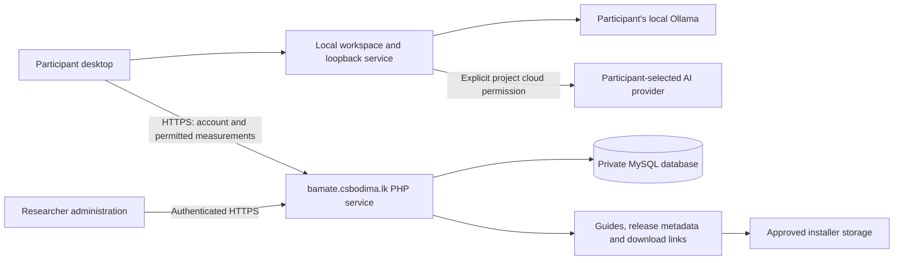

# Step 4 — Shared-hosting plan and readiness checks

Prepared 21 September 2026. Status: architecture and public capability review complete; account verification and deployment pending. This is the hosting step in the agreed research checklist, not the older roadmap's implementation workstream 4.

## Decision

Use the existing Register.lk Core account and proposed **bamate.csbodima.lk** subdomain for the website, guides, participant access and a small research service. Prefer a request/response **PHP + MySQL** implementation. Node/Python availability does not create a need to run another server or move the desktop's Python service online. No separate VPS or researcher-hosted inference is required by this design.

The researcher confirms a single-domain Core subscription with subdomains, PHP/MySQL and Node/Python options. The current public Core offering lists PHP, MySQL, subdomains, SSL, cron and Node/Python; Core 1+ advertises 7 GB storage. The provider restricts file sharing as a website's main function and says user backups are removed after 24 hours. These are advertised terms, not measurements of this account. Confirm permission and limits for distributing the project's own installers, and retain backups off-host. [Register.lk hosting capabilities and conditions](https://register.lk/hosting.php), accessed 21 September 2026.

**Assessment:** the proposed lightweight service is plausible on the reported hosting. Installer delivery and actual account capacity remain conditional. An existing subdomain and PHP/MySQL do not establish that authentication, collection or update delivery already exists.

## Responsibility and data boundaries

Private evidence, company names, sources, conversations, requirements, documents, diagrams and original model output stay in the local workspace. Explicitly selected context may go to the chosen AI provider; that is a separate permission from research participation. There is no proposed researcher inference proxy.

Desktop clients call the HTTPS service, never MySQL directly. Database credentials and administration secrets belong on the server outside the public document root. The existing local FastAPI service remains loopback-only. A separate subdomain, database and DB user provide logical separation; shared-account hosting does not provide separate operating-system isolation from other sites on the same account.

## Proposed web components

| Component | First beta scope | Implementation boundary |
|---|---|---|
| Public website | Purpose, framework, downloads, supported devices, privacy, manual, help | Static pages where possible; label releases accurately |
| Participant service | Invites, sign-in, recovery, revocation, consent versions, study assignment | Maintained authentication components; rate limits, expiring single-use recovery tokens and hashed stored session tokens |
| Collection API | Small authenticated batches of explicitly allowed measurements and feedback | Validate server-side; duplicate-safe event IDs; strict size/rate limits; reject extra fields |
| Researcher administration | Participant status, permitted data exports, consent/withdrawal handling, release management | Separate authorisation; no access to private desktop projects |
| Release service | OS/architecture/channel/version metadata, checksums, release notes and installer links | Signed packages/update metadata; do not treat a checksum alone as publisher authentication |
| Scheduled maintenance | Retention, token cleanup, backup export and health checks | Short cron tasks, no continuously running worker required |

Suggested routes are `/`, `/download`, `/guides`, `/releases`, `/api/v1` and `/admin`. These are design proposals, not deployed endpoints.

Use distinct records for account/contact identity, study pseudonyms, invitations, sessions, consent receipts, study assignments, accepted measurement events, participant feedback, releases and administrative actions. Keep any contact-to-pseudonym mapping access-restricted. Store no model-provider secret in the analytics database. Set retention and withdrawal rules from the approved protocol before collection begins.

## Minimum collection contract

The server accepts a versioned allowlist, for example: random event ID, random study/run/participant codes, consent version, app/framework/prompt/model-profile versions, task category, condition, duration, outcome/error category, provider-reported usage where available, and explicitly submitted ratings. Define units, missing values and interpretation in the evaluation instruments. A provider reporting no usage is not zero usage.

Exclude arbitrary local IDs, project names, filenames/paths, source text, prompts, outputs, content hashes, API keys and unreviewed diagnostic text. Avoid precise click trails unless required and specifically consented. Optional free-text feedback needs a private-data reminder and preview. Server access logs and backups need minimisation and retention too.

The former local `safeResearchExport` helper was retired because it included local identifiers and broadly copied metadata. Remote collection now uses only the separate allowlisted serializer and server validator; do not upload an entire local research JSON export.

Offline work remains usable after enrollment under an explicit session-expiry policy. Queue only permitted measurements while consent remains active. Reconnection must recheck consent, account status and schema, retry with backoff and deduplicate. Withdrawing consent must stop new collection and address unsent records according to the agreed policy. Signing out or losing network access must not delete a private project. Cloud model access still requires its own network/provider availability.

## Capacity and affordability

Planning examples, not observed usage or provider guarantees:

- Three installers at 200 MB each, retaining two compatible releases: about **1.2 GB** of release files.
- Fifteen participants downloading four 200 MB packages: about **12 GB** of transfer over the study.
- Fifteen participants producing 200 events/day for 30 days at 1 KB/event: about **90 MB** of raw events, before indexes/logs/backups. This is a sizing example, not a recommendation to collect that many events.

Measure actual installers and database growth. Include the existing main website, email, database, temporary release files and free operating space in the account total. Retain a current and compatible previous release where capacity permits. Transfer encrypted backups to a researcher-controlled off-host location and test recovery.

If the host does not permit installer distribution or capacity is inadequate, keep the site/API here and use a permitted external release-file host. This does not require a VPS. BYOK and Ollama remain the first beta routes. Any manually sponsored provider credentials need independently enforced spending limits before issue; no budget or paid service was activated by this plan.

## Account and deployment checklist

All unchecked items below require evidence from the actual account or deployed staging service. No hosting login was used during this audit.

| Order | Check/action | Evidence to record | Status |
|---|---|---|---|
| H01 | Confirm purchased Core variant, location, current storage, process/request limits and domain mapping | Account plan/usage record, with secrets removed | Pending |
| H02 | Confirm own-app DMG/EXE/ZIP delivery, maximum file size, traffic/range-download policy and update-feed suitability | Provider response or applicable account terms | Pending |
| H03 | Create subdomain/document root and verify HTTPS renewal, redirects and database isolation | Successful staging request; no directory listing or secret-file exposure | Pending |
| H04 | Select supported PHP version and verify required extensions, MySQL transactions/charset, cron and deployment method | Small staging capability report; no public diagnostic page retained | Pending |
| H05 | Confirm invite/recovery delivery, limits and sender configuration | Delivery and expired/reused-token cases | Pending |
| H06 | Fix consent schema, permissions, retention and offline rules | Reviewed participant materials and versioned API contract | Pending |
| H07 | Implement account service and least-privilege admin access | Authentication, revocation, rate-limit and authorisation tests | Pending |
| H08 | Implement consented submission and administration | Synthetic reconnect/duplicate/revoked-consent tests; reject private-content fields | Pending |
| H09 | Configure release storage and signed update route | Windows/macOS download and upgrade/recovery results | Pending |
| H10 | Back up, restore and rehearse recovery | Encrypted off-host backup restored into an isolated database | Pending |
| H11 | Rehearse expected beta load and support procedure | Measured response times, storage and errors; named operator | Pending |

The deployment package now keeps Apache rewrite rules in `research-service/public/.htaccess`, matching the required public document root. The released desktop receives only `VITE_BA_MATE_RESEARCH_URL` at build time; this is a public HTTPS origin and must never be confused with a database/server credential.

Do not delay local BA workflow repairs while waiting for H01–H05. Build the research service after the collection contract is fixed. Do not circulate until the relevant gates in the [implementation backlog](../audit/IMPLEMENTATION_BACKLOG.md) pass.
